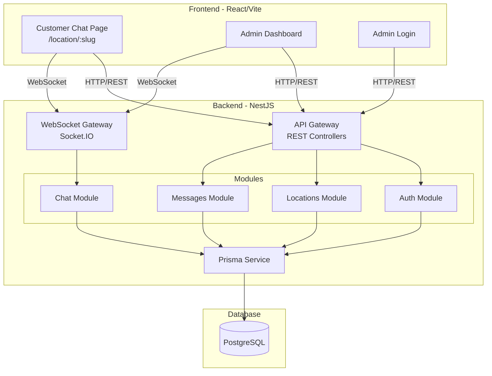
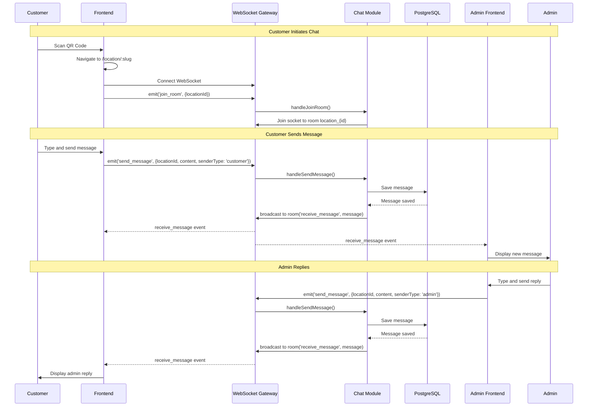
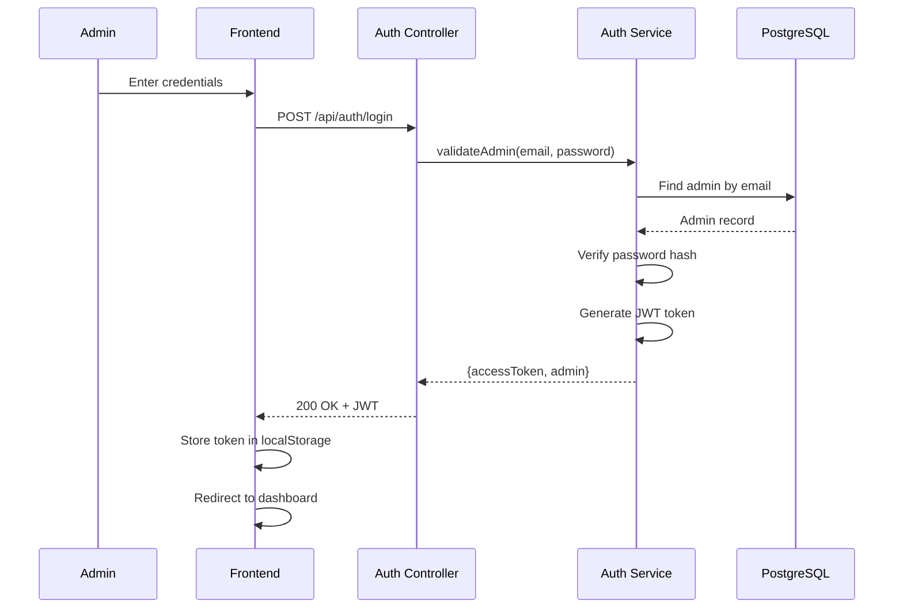

# Design Document: QR-Based Customer Support Chat

## Overview

This design document outlines a modern realtime QR-based customer support chat web application for A25 Hotel. The system enables customers to scan QR codes placed at approximately 70 unique locations/addresses, which redirect them to dedicated chat pages where they can communicate directly with admins in realtime.

The architecture follows a client-server model with React/Vite frontend and NestJS backend, using Socket.IO for bidirectional realtime communication. Each location has its own chat room, allowing admins to manage multiple customer conversations from a centralized dashboard. The system prioritizes mobile-first responsive design, instant message delivery, and a clean UI similar to modern support chat systems like Intercom or WhatsApp Web.

Key design decisions include: anonymous customer access (no authentication required), JWT-based admin authentication, PostgreSQL for message persistence via Prisma ORM, and a modular NestJS architecture with dedicated modules for auth, locations, messages, and websocket handling.

## Architecture

### High-Level System Architecture



### Realtime Communication Flow



### Authentication Flow



## Components and Interfaces

### Backend Module Structure

```
server/src/
├── main.ts
├── app.module.ts
├── common/
│   ├── decorators/
│   │   └── current-admin.decorator.ts
│   ├── guards/
│   │   └── jwt-auth.guard.ts
│   └── filters/
│       └── ws-exception.filter.ts
├── prisma/
│   ├── prisma.module.ts
│   └── prisma.service.ts
├── auth/
│   ├── auth.module.ts
│   ├── auth.controller.ts
│   ├── auth.service.ts
│   ├── dto/
│   │   └── login.dto.ts
│   └── strategies/
│       └── jwt.strategy.ts
├── locations/
│   ├── locations.module.ts
│   ├── locations.controller.ts
│   ├── locations.service.ts
│   └── dto/
│       ├── create-location.dto.ts
│       └── update-location.dto.ts
├── messages/
│   ├── messages.module.ts
│   ├── messages.controller.ts
│   ├── messages.service.ts
│   └── dto/
│       └── create-message.dto.ts
└── chat/
    ├── chat.module.ts
    ├── chat.gateway.ts
    └── dto/
        ├── join-room.dto.ts
        └── send-message.dto.ts
```

### Frontend Structure

```
web/src/
├── main.tsx
├── App.tsx
├── index.css
├── api/
│   ├── client.ts
│   ├── auth.ts
│   ├── locations.ts
│   └── messages.ts
├── hooks/
│   ├── useSocket.ts
│   ├── useAuth.ts
│   └── useMessages.ts
├── contexts/
│   ├── AuthContext.tsx
│   └── SocketContext.tsx
├── pages/
│   ├── CustomerChat.tsx
│   ├── AdminLogin.tsx
│   └── AdminDashboard.tsx
├── components/
│   ├── chat/
│   │   ├── MessageList.tsx
│   │   ├── MessageBubble.tsx
│   │   ├── ChatInput.tsx
│   │   └── TypingIndicator.tsx
│   ├── admin/
│   │   ├── LocationSidebar.tsx
│   │   ├── LocationItem.tsx
│   │   └── ConnectionStatus.tsx
│   └── common/
│       ├── LoadingSpinner.tsx
│       └── ErrorMessage.tsx
└── types/
    └── index.ts
```

### Component 1: WebSocket Gateway (Chat Gateway)

**Purpose**: Handles all realtime WebSocket communication for chat functionality, managing room subscriptions and message broadcasting.

**Interface**:

```typescript
@WebSocketGateway({
  cors: { origin: '*' },
  namespace: '/chat'
})
export class ChatGateway implements OnGatewayConnection, OnGatewayDisconnect {
  @WebSocketServer()
  server: Server;

  handleConnection(client: Socket): void;
  handleDisconnect(client: Socket): void;

  @SubscribeMessage('join_room')
  handleJoinRoom(client: Socket, payload: JoinRoomDto): Promise<void>;

  @SubscribeMessage('leave_room')
  handleLeaveRoom(client: Socket, payload: { locationId: string }): void;

  @SubscribeMessage('send_message')
  handleSendMessage(client: Socket, payload: SendMessageDto): Promise<Message>;

  @SubscribeMessage('typing_start')
  handleTypingStart(client: Socket, payload: TypingDto): void;

  @SubscribeMessage('typing_stop')
  handleTypingStop(client: Socket, payload: TypingDto): void;
}
```

**Responsibilities**:

- Manage WebSocket connections and disconnections
- Handle room join/leave operations for location-based chat rooms
- Broadcast messages to all clients in a room
- Handle typing indicators for both customers and admins
- Validate incoming socket events

### Component 2: Auth Service

**Purpose**: Handles admin authentication including login validation and JWT token generation.

**Interface**:

```typescript
@Injectable()
export class AuthService {
  constructor(
    private prisma: PrismaService,
    private jwtService: JwtService,
  ) {}

  async validateAdmin(email: string, password: string): Promise<Admin | null>;
  async login(
    loginDto: LoginDto,
  ): Promise<{ accessToken: string; admin: AdminResponse }>;
  async validateToken(token: string): Promise<JwtPayload | null>;
}
```

**Responsibilities**:

- Validate admin credentials against database
- Generate JWT access tokens
- Verify password hashes using bcrypt
- Handle token validation for protected routes

### Component 3: Locations Service

**Purpose**: Manages CRUD operations for location entities and QR code URL generation.

**Interface**:

```typescript
@Injectable()
export class LocationsService {
  constructor(private prisma: PrismaService) {}

  async create(createLocationDto: CreateLocationDto): Promise<Location>;
  async findAll(): Promise<Location[]>;
  async findOne(id: string): Promise<Location | null>;
  async findBySlug(slug: string): Promise<Location | null>;
  async update(
    id: string,
    updateLocationDto: UpdateLocationDto,
  ): Promise<Location>;
  async delete(id: string): Promise<void>;
  async getLocationWithLatestMessage(id: string): Promise<LocationWithPreview>;
  async getAllWithUnreadCount(): Promise<LocationWithUnread[]>;
}
```

**Responsibilities**:

- Create, read, update, delete location records
- Generate unique slugs for QR code URLs
- Retrieve locations with message previews for admin dashboard
- Track unread message counts per location

### Component 4: Messages Service

**Purpose**: Handles message persistence and retrieval for chat conversations.

**Interface**:

```typescript
@Injectable()
export class MessagesService {
  constructor(private prisma: PrismaService) {}

  async create(createMessageDto: CreateMessageDto): Promise<Message>;
  async findByLocation(
    locationId: string,
    options?: PaginationOptions,
  ): Promise<Message[]>;
  async markAsRead(locationId: string): Promise<void>;
  async getUnreadCount(locationId: string): Promise<number>;
}
```

**Responsibilities**:

- Persist new messages to database
- Retrieve message history for a location
- Support pagination for message loading
- Track and update read status

## Data Models

### Prisma Schema

```prisma
// prisma/schema.prisma

generator client {
  provider = "prisma-client-js"
}

datasource db {
  provider = "postgresql"
  url      = env("DATABASE_URL")
}

model Admin {
  id           String   @id @default(uuid())
  email        String   @unique
  passwordHash String   @map("password_hash")
  createdAt    DateTime @default(now()) @map("created_at")

  @@map("admins")
}

model Location {
  id        String    @id @default(uuid())
  name      String
  slug      String    @unique
  qrCodeUrl String?   @map("qr_code_url")
  createdAt DateTime  @default(now()) @map("created_at")
  messages  Message[]

  @@map("locations")
}

model Message {
  id         String     @id @default(uuid())
  locationId String     @map("location_id")
  senderType SenderType @map("sender_type")
  content    String
  isRead     Boolean    @default(false) @map("is_read")
  createdAt  DateTime   @default(now()) @map("created_at")
  location   Location   @relation(fields: [locationId], references: [id], onDelete: Cascade)

  @@index([locationId, createdAt])
  @@map("messages")
}

enum SenderType {
  customer
  admin
}
```

### TypeScript Type Definitions

```typescript
// types/index.ts

export interface Location {
  id: string;
  name: string;
  slug: string;
  qrCodeUrl: string | null;
  createdAt: Date;
}

export interface Message {
  id: string;
  locationId: string;
  senderType: "customer" | "admin";
  content: string;
  isRead: boolean;
  createdAt: Date;
}

export interface Admin {
  id: string;
  email: string;
  createdAt: Date;
}

export interface LocationWithPreview extends Location {
  latestMessage: Message | null;
  unreadCount: number;
}

export interface JwtPayload {
  sub: string;
  email: string;
  iat: number;
  exp: number;
}

// Socket Event Payloads
export interface JoinRoomPayload {
  locationId: string;
}

export interface SendMessagePayload {
  locationId: string;
  content: string;
  senderType: "customer" | "admin";
}

export interface TypingPayload {
  locationId: string;
  senderType: "customer" | "admin";
}

export interface ReceiveMessagePayload {
  message: Message;
}
```

**Validation Rules**:

- `Location.slug`: Must be unique, URL-safe (lowercase alphanumeric with hyphens)
- `Location.name`: Required, max 255 characters
- `Message.content`: Required, max 2000 characters
- `Admin.email`: Must be valid email format, unique
- `Admin.passwordHash`: Minimum 8 characters before hashing

## Key Functions with Formal Specifications

### Function 1: handleSendMessage (WebSocket Gateway)

```typescript
async handleSendMessage(
  client: Socket,
  payload: SendMessageDto
): Promise<Message>
```

**Preconditions:**

- `client` is a valid connected Socket instance
- `payload.locationId` is a valid UUID referencing an existing location
- `payload.content` is a non-empty string with length ≤ 2000 characters
- `payload.senderType` is either 'customer' or 'admin'
- Client has previously joined the room `location_{payload.locationId}`

**Postconditions:**

- A new Message record is persisted in the database
- The returned Message object contains a valid UUID `id`
- `message.createdAt` is set to the current timestamp
- All clients in room `location_{payload.locationId}` receive the 'receive_message' event
- If senderType is 'admin', `message.isRead` is set to true
- If senderType is 'customer', `message.isRead` is set to false

**Loop Invariants:** N/A (no loops in this function)

### Function 2: validateAdmin (Auth Service)

```typescript
async validateAdmin(
  email: string,
  password: string
): Promise<Admin | null>
```

**Preconditions:**

- `email` is a non-empty string in valid email format
- `password` is a non-empty string

**Postconditions:**

- Returns `Admin` object if email exists AND password hash matches
- Returns `null` if email does not exist OR password hash does not match
- No database mutations occur
- Password is never logged or stored in plain text

**Loop Invariants:** N/A

### Function 3: findByLocation (Messages Service)

```typescript
async findByLocation(
  locationId: string,
  options?: { limit?: number; cursor?: string }
): Promise<Message[]>
```

**Preconditions:**

- `locationId` is a valid UUID
- If provided, `options.limit` is a positive integer ≤ 100
- If provided, `options.cursor` is a valid message UUID

**Postconditions:**

- Returns array of Message objects ordered by `createdAt` descending
- Array length ≤ `options.limit` (default 50)
- If `cursor` provided, returns messages created before the cursor message
- All returned messages have `locationId` matching the input
- Empty array returned if location has no messages

**Loop Invariants:** N/A

### Function 4: handleJoinRoom (WebSocket Gateway)

```typescript
async handleJoinRoom(
  client: Socket,
  payload: JoinRoomDto
): Promise<void>
```

**Preconditions:**

- `client` is a valid connected Socket instance
- `payload.locationId` is a valid UUID referencing an existing location

**Postconditions:**

- Client socket is added to room `location_{payload.locationId}`
- Client receives 'room_joined' acknowledgment event
- Client receives initial message history (last 50 messages)
- Other clients in room are NOT notified of new join (privacy)

**Loop Invariants:** N/A

## Algorithmic Pseudocode

### Main Processing Algorithm: Message Send Flow

```pascal
ALGORITHM handleMessageSend(client, payload)
INPUT: client of type Socket, payload of type SendMessageDto
OUTPUT: message of type Message

BEGIN
  // Step 1: Validate payload
  ASSERT payload.locationId IS valid UUID
  ASSERT payload.content IS non-empty AND length <= 2000
  ASSERT payload.senderType IN ['customer', 'admin']

  // Step 2: Verify location exists
  location ← database.locations.findById(payload.locationId)
  IF location IS NULL THEN
    THROW WsException("Location not found")
  END IF

  // Step 3: Create message record
  message ← database.messages.create({
    locationId: payload.locationId,
    senderType: payload.senderType,
    content: payload.content,
    isRead: payload.senderType = 'admin',
    createdAt: NOW()
  })

  ASSERT message.id IS valid UUID

  // Step 4: Broadcast to room
  roomName ← "location_" + payload.locationId
  server.to(roomName).emit('receive_message', { message })

  // Step 5: Return created message
  RETURN message
END
```

**Preconditions:**

- Client is connected and authenticated (if admin)
- Database connection is available
- Socket server is running

**Postconditions:**

- Message is persisted in database
- All room members receive the message
- Function returns the created message object

**Loop Invariants:** N/A

### Admin Authentication Algorithm

```pascal
ALGORITHM authenticateAdmin(email, password)
INPUT: email of type String, password of type String
OUTPUT: authResult of type { accessToken: String, admin: Admin } OR throws UnauthorizedException

BEGIN
  // Step 1: Validate input format
  ASSERT email matches EMAIL_REGEX
  ASSERT password.length >= 1

  // Step 2: Find admin by email
  admin ← database.admins.findByEmail(email)
  IF admin IS NULL THEN
    THROW UnauthorizedException("Invalid credentials")
  END IF

  // Step 3: Verify password
  isValidPassword ← bcrypt.compare(password, admin.passwordHash)
  IF NOT isValidPassword THEN
    THROW UnauthorizedException("Invalid credentials")
  END IF

  // Step 4: Generate JWT token
  payload ← {
    sub: admin.id,
    email: admin.email
  }
  accessToken ← jwtService.sign(payload, {
    expiresIn: '24h'
  })

  // Step 5: Return auth result
  RETURN {
    accessToken: accessToken,
    admin: {
      id: admin.id,
      email: admin.email,
      createdAt: admin.createdAt
    }
  }
END
```

**Preconditions:**

- Email and password are provided
- Database connection is available
- JWT secret is configured

**Postconditions:**

- Returns valid JWT token if credentials match
- Throws UnauthorizedException if credentials invalid
- Password is never exposed in response

**Loop Invariants:** N/A

### WebSocket Connection Management Algorithm

```pascal
ALGORITHM handleSocketConnection(client)
INPUT: client of type Socket
OUTPUT: void

BEGIN
  // Step 1: Extract connection metadata
  clientId ← client.id
  handshake ← client.handshake

  // Step 2: Log connection
  logger.log("Client connected: " + clientId)

  // Step 3: Store client metadata
  connectedClients.set(clientId, {
    connectedAt: NOW(),
    rooms: []
  })

  // Step 4: Set up disconnect handler
  client.on('disconnect', () => {
    logger.log("Client disconnected: " + clientId)
    connectedClients.delete(clientId)
  })
END

ALGORITHM handleSocketDisconnect(client)
INPUT: client of type Socket
OUTPUT: void

BEGIN
  clientId ← client.id

  // Step 1: Get client metadata
  clientData ← connectedClients.get(clientId)

  // Step 2: Leave all rooms
  IF clientData IS NOT NULL THEN
    FOR EACH roomName IN clientData.rooms DO
      client.leave(roomName)
    END FOR
  END IF

  // Step 3: Clean up
  connectedClients.delete(clientId)
  logger.log("Client disconnected: " + clientId)
END
```

**Preconditions:**

- Socket.IO server is initialized
- Client has valid socket connection

**Postconditions:**

- Client metadata is tracked during connection
- All resources are cleaned up on disconnect
- No memory leaks from orphaned connections

**Loop Invariants:**

- For room cleanup loop: All previously processed rooms have been left
- connectedClients map remains consistent throughout iteration

## Example Usage

### Backend: WebSocket Gateway Implementation

```typescript
// chat/chat.gateway.ts
import {
  WebSocketGateway,
  WebSocketServer,
  SubscribeMessage,
  OnGatewayConnection,
  OnGatewayDisconnect,
  WsException,
} from "@nestjs/websockets";
import { Server, Socket } from "socket.io";
import { MessagesService } from "../messages/messages.service";
import { LocationsService } from "../locations/locations.service";

@WebSocketGateway({
  cors: { origin: "*" },
  namespace: "/chat",
})
export class ChatGateway implements OnGatewayConnection, OnGatewayDisconnect {
  @WebSocketServer()
  server: Server;

  constructor(
    private messagesService: MessagesService,
    private locationsService: LocationsService,
  ) {}

  handleConnection(client: Socket) {
    console.log(`Client connected: ${client.id}`);
  }

  handleDisconnect(client: Socket) {
    console.log(`Client disconnected: ${client.id}`);
  }

  @SubscribeMessage("join_room")
  async handleJoinRoom(client: Socket, payload: { locationId: string }) {
    const location = await this.locationsService.findOne(payload.locationId);
    if (!location) {
      throw new WsException("Location not found");
    }

    const roomName = `location_${payload.locationId}`;
    client.join(roomName);

    // Send message history
    const messages = await this.messagesService.findByLocation(
      payload.locationId,
    );
    client.emit("message_history", { messages });
    client.emit("room_joined", { locationId: payload.locationId });
  }

  @SubscribeMessage("send_message")
  async handleSendMessage(
    client: Socket,
    payload: {
      locationId: string;
      content: string;
      senderType: "customer" | "admin";
    },
  ) {
    const message = await this.messagesService.create({
      locationId: payload.locationId,
      content: payload.content,
      senderType: payload.senderType,
    });

    const roomName = `location_${payload.locationId}`;
    this.server.to(roomName).emit("receive_message", { message });

    return message;
  }

  @SubscribeMessage("typing_start")
  handleTypingStart(
    client: Socket,
    payload: { locationId: string; senderType: "customer" | "admin" },
  ) {
    const roomName = `location_${payload.locationId}`;
    client.to(roomName).emit("user_typing", {
      senderType: payload.senderType,
      isTyping: true,
    });
  }

  @SubscribeMessage("typing_stop")
  handleTypingStop(
    client: Socket,
    payload: { locationId: string; senderType: "customer" | "admin" },
  ) {
    const roomName = `location_${payload.locationId}`;
    client.to(roomName).emit("user_typing", {
      senderType: payload.senderType,
      isTyping: false,
    });
  }
}
```

### Frontend: Custom Socket Hook

```typescript
// hooks/useSocket.ts
import { useEffect, useRef, useState, useCallback } from "react";
import { io, Socket } from "socket.io-client";
import { Message } from "../types";

const SOCKET_URL = import.meta.env.VITE_API_URL || "http://localhost:3000";

export function useSocket(locationId: string | null) {
  const socketRef = useRef<Socket | null>(null);
  const [isConnected, setIsConnected] = useState(false);
  const [messages, setMessages] = useState<Message[]>([]);
  const [isTyping, setIsTyping] = useState(false);

  useEffect(() => {
    if (!locationId) return;

    const socket = io(`${SOCKET_URL}/chat`, {
      transports: ["websocket"],
    });

    socketRef.current = socket;

    socket.on("connect", () => {
      setIsConnected(true);
      socket.emit("join_room", { locationId });
    });

    socket.on("disconnect", () => {
      setIsConnected(false);
    });

    socket.on("message_history", ({ messages }) => {
      setMessages(messages);
    });

    socket.on("receive_message", ({ message }) => {
      setMessages((prev) => [...prev, message]);
    });

    socket.on("user_typing", ({ senderType, isTyping }) => {
      setIsTyping(isTyping);
    });

    return () => {
      socket.disconnect();
    };
  }, [locationId]);

  const sendMessage = useCallback(
    (content: string, senderType: "customer" | "admin") => {
      if (socketRef.current && locationId) {
        socketRef.current.emit("send_message", {
          locationId,
          content,
          senderType,
        });
      }
    },
    [locationId],
  );

  const startTyping = useCallback(
    (senderType: "customer" | "admin") => {
      if (socketRef.current && locationId) {
        socketRef.current.emit("typing_start", { locationId, senderType });
      }
    },
    [locationId],
  );

  const stopTyping = useCallback(
    (senderType: "customer" | "admin") => {
      if (socketRef.current && locationId) {
        socketRef.current.emit("typing_stop", { locationId, senderType });
      }
    },
    [locationId],
  );

  return {
    isConnected,
    messages,
    isTyping,
    sendMessage,
    startTyping,
    stopTyping,
  };
}
```

### Frontend: Customer Chat Page

```typescript
// pages/CustomerChat.tsx
import { useParams } from 'react-router-dom';
import { useState, useEffect } from 'react';
import { useSocket } from '../hooks/useSocket';
import { MessageList } from '../components/chat/MessageList';
import { ChatInput } from '../components/chat/ChatInput';
import { TypingIndicator } from '../components/chat/TypingIndicator';
import { api } from '../api/client';
import { Location } from '../types';

export function CustomerChat() {
  const { slug } = useParams<{ slug: string }>();
  const [location, setLocation] = useState<Location | null>(null);
  const [loading, setLoading] = useState(true);

  useEffect(() => {
    async function fetchLocation() {
      try {
        const data = await api.locations.getBySlug(slug!);
        setLocation(data);
      } catch (error) {
        console.error('Location not found');
      } finally {
        setLoading(false);
      }
    }
    fetchLocation();
  }, [slug]);

  const { isConnected, messages, isTyping, sendMessage, startTyping, stopTyping } =
    useSocket(location?.id ?? null);

  const handleSend = (content: string) => {
    sendMessage(content, 'customer');
  };

  if (loading) {
    return <div className="flex items-center justify-center h-screen">Loading...</div>;
  }

  if (!location) {
    return <div className="flex items-center justify-center h-screen">Location not found</div>;
  }

  return (
    <div className="flex flex-col h-screen bg-background">
      {/* Header */}
      <header className="bg-white border-b border-border px-4 py-3 flex items-center gap-3">
        <div className="w-10 h-10 rounded-full bg-primary flex items-center justify-center">
          <span className="text-white font-semibold">A</span>
        </div>
        <div>
          <h1 className="font-semibold text-text">{location.name}</h1>
          <p className="text-xs text-text-muted">
            {isConnected ? 'Online' : 'Connecting...'}
          </p>
        </div>
      </header>

      {/* Messages */}
      <div className="flex-1 overflow-y-auto p-4">
        <MessageList messages={messages} currentSender="customer" />
        {isTyping && <TypingIndicator />}
      </div>

      {/* Input */}
      <ChatInput
        onSend={handleSend}
        onTypingStart={() => startTyping('customer')}
        onTypingStop={() => stopTyping('customer')}
        disabled={!isConnected}
      />
    </div>
  );
}
```

### Frontend: Admin Dashboard

```typescript
// pages/AdminDashboard.tsx
import { useState, useEffect } from 'react';
import { useAuth } from '../hooks/useAuth';
import { useSocket } from '../hooks/useSocket';
import { LocationSidebar } from '../components/admin/LocationSidebar';
import { MessageList } from '../components/chat/MessageList';
import { ChatInput } from '../components/chat/ChatInput';
import { ConnectionStatus } from '../components/admin/ConnectionStatus';
import { api } from '../api/client';
import { LocationWithPreview } from '../types';

export function AdminDashboard() {
  const { admin } = useAuth();
  const [locations, setLocations] = useState<LocationWithPreview[]>([]);
  const [selectedLocation, setSelectedLocation] = useState<string | null>(null);

  const { isConnected, messages, isTyping, sendMessage, startTyping, stopTyping } =
    useSocket(selectedLocation);

  useEffect(() => {
    async function fetchLocations() {
      const data = await api.locations.getAllWithUnread();
      setLocations(data);
    }
    fetchLocations();
  }, []);

  const handleSend = (content: string) => {
    sendMessage(content, 'admin');
  };

  const selectedLocationData = locations.find((l) => l.id === selectedLocation);

  return (
    <div className="flex h-screen bg-background">
      {/* Sidebar */}
      <LocationSidebar
        locations={locations}
        selectedId={selectedLocation}
        onSelect={setSelectedLocation}
      />

      {/* Main Chat Area */}
      <div className="flex-1 flex flex-col">
        {selectedLocation ? (
          <>
            {/* Header */}
            <header className="bg-white border-b border-border px-4 py-3 flex items-center justify-between">
              <div>
                <h1 className="font-semibold text-text">
                  {selectedLocationData?.name}
                </h1>
                <p className="text-xs text-text-muted">Customer Support Chat</p>
              </div>
              <ConnectionStatus isConnected={isConnected} />
            </header>

            {/* Messages */}
            <div className="flex-1 overflow-y-auto p-4">
              <MessageList messages={messages} currentSender="admin" />
              {isTyping && (
                <p className="text-sm text-text-muted italic">Customer is typing...</p>
              )}
            </div>

            {/* Input */}
            <ChatInput
              onSend={handleSend}
              onTypingStart={() => startTyping('admin')}
              onTypingStop={() => stopTyping('admin')}
              disabled={!isConnected}
            />
          </>
        ) : (
          <div className="flex-1 flex items-center justify-center text-text-muted">
            Select a location to start chatting
          </div>
        )}
      </div>
    </div>
  );
}
```

## Correctness Properties

_A property is a characteristic or behavior that should hold true across all valid executions of a system—essentially, a formal statement about what the system should do. Properties serve as the bridge between human-readable specifications and machine-verifiable correctness guarantees._

The following properties must hold for the system to be considered correct:

### Property 1: Slug Uniqueness and URL-Safety

_For any_ set of locations in the system, all slugs SHALL be unique and URL-safe (lowercase alphanumeric with hyphens only).

**Validates: Requirements 1.4, 1.5, 5.1, 5.5**

### Property 2: Location Resolution Correctness

_For any_ valid slug, the system SHALL resolve it to the correct location; _for any_ non-existent slug, the system SHALL return a "Location not found" error.

**Validates: Requirements 1.1, 1.2**

### Property 3: Message History Limit

_For any_ room join operation, the message history returned SHALL contain at most 50 messages.

**Validates: Requirement 2.4**

### Property 4: Sender Type Validation

_For any_ message received with an invalid senderType (not 'customer' or 'admin'), the system SHALL either reject the message or force-override the senderType to the appropriate value.

**Validates: Requirement 2.9**

### Property 5: Authentication Token Generation

_For any_ valid admin credentials, the Auth_Service SHALL return a JWT token with a 24-hour expiration.

**Validates: Requirements 3.1, 3.4**

### Property 6: Authentication Failure Security

_For any_ invalid credentials or expired/invalid JWT token, the system SHALL return 401 Unauthorized and SHALL NOT return any JWT token or success status.

**Validates: Requirements 3.2, 3.5**

### Property 7: Password Hash Security

_For any_ API response from the system, password hashes SHALL never be included in the response payload.

**Validates: Requirement 3.6**

### Property 8: Authorization Enforcement

_For any_ request to the Admin_Dashboard or protected admin endpoints, the system SHALL require a valid JWT token.

**Validates: Requirement 4.1**

### Property 9: Unread Count Accuracy

_For any_ location, the unread message count SHALL equal the number of customer messages with isRead=false for that location.

**Validates: Requirements 4.2, 12.3**

### Property 10: Location Update Persistence

_For any_ location update operation, the updated fields SHALL be persisted correctly and retrievable.

**Validates: Requirement 5.2**

### Property 11: Cascade Delete Integrity

_For any_ location deletion, all associated messages SHALL be deleted along with the location.

**Validates: Requirements 5.3, 7.4**

### Property 12: Location Name Validation

_For any_ location name, the system SHALL accept names up to 255 characters (including empty strings) and reject names exceeding 255 characters.

**Validates: Requirement 5.4**

### Property 13: Message Persistence Guarantee

_For any_ message sent via the send_message event, the message SHALL be persisted to the database with a unique UUID.

**Validates: Requirements 6.1, 7.1**

### Property 14: Room Isolation

_For any_ message sent to a Chat_Room, the message SHALL only be delivered to clients in that specific room and SHALL NOT be delivered to clients in other rooms.

**Validates: Requirements 6.2, 6.5**

### Property 15: Read Status by Sender Type

_For any_ message created, if senderType is 'admin' then isRead SHALL be true; if senderType is 'customer' then isRead SHALL be false.

**Validates: Requirements 6.3, 12.1**

### Property 16: Message Ordering Consistency

_For any_ location, messages SHALL be ordered by createdAt timestamp in descending order when retrieved, and in chronological order when displayed.

**Validates: Requirements 6.6, 7.2**

### Property 17: Pagination Correctness

_For any_ message retrieval with pagination, the system SHALL return at most the specified limit (default 50) and support cursor-based pagination without overlapping results.

**Validates: Requirement 7.3**

### Property 18: Message Content Validation

_For any_ message content, the system SHALL accept non-empty content up to 2000 characters and reject empty content or content exceeding 2000 characters.

**Validates: Requirement 7.5**

### Property 19: Client Cleanup on Disconnect

_For any_ client disconnection, the WebSocket_Gateway SHALL remove the client from all joined rooms.

**Validates: Requirement 9.3**

### Property 20: DTO Validation Enforcement

_For any_ incoming DTO, the system SHALL validate it using class-validator and reject invalid DTOs before processing.

**Validates: Requirement 10.1**

### Property 21: Invalid Payload Error Handling

_For any_ invalid payload received via WebSocket, the WebSocket_Gateway SHALL throw a WsException with a descriptive error message.

**Validates: Requirement 10.5**

### Property 22: Location Not Found Error

_For any_ room join attempt with a non-existent location ID, the WebSocket_Gateway SHALL throw a WsException with "Location not found".

**Validates: Requirement 11.1**

### Property 23: Bulk Read Status Update

_For any_ mark-as-read operation on a location, all customer messages in that location SHALL have their isRead field updated to true.

**Validates: Requirement 12.4**

## Error Handling

### Error Scenario 1: Location Not Found

**Condition**: Customer navigates to `/location/:slug` with non-existent slug
**Response**:

- Frontend displays friendly "Location not found" message
- No WebSocket connection attempted
- User can navigate back or scan a different QR code
  **Recovery**: User scans correct QR code or contacts support

### Error Scenario 2: WebSocket Connection Failure

**Condition**: Socket.IO fails to establish connection (network issues, server down)
**Response**:

- Frontend shows "Connecting..." status indicator
- Socket.IO automatically attempts reconnection with exponential backoff
- Messages typed during disconnection are queued locally
  **Recovery**:
- Automatic reconnection when network restored
- Queued messages sent upon reconnection
- User notified when connection restored

### Error Scenario 3: Invalid JWT Token

**Condition**: Admin's JWT token is expired or malformed
**Response**:

- API returns 401 Unauthorized
- Frontend clears stored token
- User redirected to login page
  **Recovery**: Admin re-authenticates with valid credentials

### Error Scenario 4: Message Send Failure

**Condition**: Database write fails when saving message
**Response**:

- WebSocket throws WsException
- Client receives error event
- Message marked as "failed" in UI with retry option
  **Recovery**: User can retry sending the message

### Error Scenario 5: Database Connection Lost

**Condition**: PostgreSQL connection pool exhausted or database unreachable
**Response**:

- Prisma throws connection error
- API returns 503 Service Unavailable
- WebSocket operations fail gracefully
  **Recovery**:
- Connection pool auto-recovers
- Health check endpoint monitors database status
- Admin notified via logs

## Testing Strategy

### Unit Testing Approach

**Backend Unit Tests**:

- Test each service method in isolation with mocked Prisma client
- Test DTO validation with class-validator
- Test JWT token generation and validation
- Test password hashing and comparison

**Frontend Unit Tests**:

- Test React components with React Testing Library
- Test custom hooks with @testing-library/react-hooks
- Test API client functions with mocked fetch

**Key Test Cases**:

```typescript
// Example: MessagesService unit test
describe("MessagesService", () => {
  it("should create a message with correct fields", async () => {
    const dto = {
      locationId: "uuid",
      content: "Hello",
      senderType: "customer",
    };
    const result = await service.create(dto);
    expect(result.id).toBeDefined();
    expect(result.content).toBe("Hello");
    expect(result.senderType).toBe("customer");
  });

  it("should return messages ordered by createdAt desc", async () => {
    const messages = await service.findByLocation("uuid");
    for (let i = 1; i < messages.length; i++) {
      expect(messages[i - 1].createdAt >= messages[i].createdAt).toBe(true);
    }
  });
});
```

### Property-Based Testing Approach

**Property Test Library**: fast-check (for TypeScript/JavaScript)

**Properties to Test**:

1. **Message Content Integrity**: Any valid string content (up to 2000 chars) should be stored and retrieved exactly as sent
2. **Slug Generation**: Generated slugs should always be URL-safe and unique
3. **JWT Token Validity**: Any generated token should be verifiable with the same secret
4. **Pagination Consistency**: Paginated results should never overlap and should cover all records

```typescript
// Example: Property-based test for message content
import * as fc from "fast-check";

describe("Message Content Property", () => {
  it("should preserve message content exactly", () => {
    fc.assert(
      fc.asyncProperty(
        fc.string({ maxLength: 2000 }).filter((s) => s.length > 0),
        async (content) => {
          const message = await messagesService.create({
            locationId: testLocationId,
            content,
            senderType: "customer",
          });
          const retrieved = await messagesService.findOne(message.id);
          return retrieved?.content === content;
        },
      ),
    );
  });
});
```

### Integration Testing Approach

**WebSocket Integration Tests**:

- Test full message flow from client to database and back
- Test room isolation (messages don't leak between rooms)
- Test reconnection behavior

**API Integration Tests**:

- Test authentication flow end-to-end
- Test CRUD operations with real database
- Test error responses for invalid inputs

**E2E Tests** (Playwright/Cypress):

- Test customer chat flow from QR scan to message send
- Test admin login and dashboard navigation
- Test realtime message updates between customer and admin

## Performance Considerations

### Database Optimization

- Index on `messages(location_id, created_at)` for efficient message retrieval
- Connection pooling via Prisma (default pool size: 10)
- Pagination for message history (default: 50 messages per request)

### WebSocket Optimization

- Use WebSocket transport only (skip HTTP long-polling fallback for demo)
- Room-based broadcasting to minimize unnecessary message delivery
- Debounce typing indicators (300ms) to reduce event frequency

### Frontend Optimization

- Virtual scrolling for message lists with many messages
- Optimistic UI updates for sent messages
- Lazy loading of location data in admin dashboard

### Scalability Notes (Future Considerations)

- For production: Consider Redis adapter for Socket.IO horizontal scaling
- For production: Implement message archival for old conversations
- Current demo scope: Single server instance is sufficient for ~70 locations

## Security Considerations

### Authentication & Authorization

- JWT tokens with 24-hour expiration
- Passwords hashed with bcrypt (cost factor: 10)
- Admin-only routes protected by JwtAuthGuard
- Customer chat requires no authentication (by design for demo)

### Input Validation

- All DTOs validated with class-validator
- Message content sanitized (max 2000 characters)
- SQL injection prevented by Prisma parameterized queries
- XSS prevention via React's default escaping

### WebSocket Security

- CORS configured for allowed origins
- Rate limiting on message sends (future enhancement)
- No sensitive data in socket payloads

### Data Protection

- Passwords never returned in API responses
- JWT secret stored in environment variables
- Database credentials in environment variables

## Dependencies

### Backend Dependencies

```json
{
  "dependencies": {
    "@nestjs/common": "^11.0.1",
    "@nestjs/core": "^11.0.1",
    "@nestjs/platform-express": "^11.0.1",
    "@nestjs/platform-socket.io": "^11.0.0",
    "@nestjs/websockets": "^11.0.0",
    "@nestjs/jwt": "^11.0.0",
    "@nestjs/passport": "^11.0.0",
    "@nestjs/config": "^4.0.0",
    "@prisma/client": "^6.0.0",
    "passport": "^0.7.0",
    "passport-jwt": "^4.0.1",
    "bcrypt": "^5.1.1",
    "class-validator": "^0.14.1",
    "class-transformer": "^0.5.1",
    "socket.io": "^4.8.0"
  },
  "devDependencies": {
    "prisma": "^6.0.0",
    "@types/bcrypt": "^5.0.2",
    "@types/passport-jwt": "^4.0.1"
  }
}
```

### Frontend Dependencies

```json
{
  "dependencies": {
    "react": "^19.2.6",
    "react-dom": "^19.2.6",
    "react-router-dom": "^7.0.0",
    "socket.io-client": "^4.8.0",
    "tailwindcss": "^4.3.0",
    "@tailwindcss/vite": "^4.3.0"
  },
  "devDependencies": {
    "@types/react": "^19.2.14",
    "@types/react-dom": "^19.2.3",
    "typescript": "~6.0.2",
    "vite": "^8.0.12"
  }
}
```

### External Services

- PostgreSQL 15+ (local or cloud-hosted)
- Node.js 20+ runtime

## REST API Endpoints

### Authentication

| Method | Endpoint          | Description       | Auth Required |
| ------ | ----------------- | ----------------- | ------------- |
| POST   | `/api/auth/login` | Admin login       | No            |
| GET    | `/api/auth/me`    | Get current admin | Yes           |

### Locations

| Method | Endpoint                         | Description                      | Auth Required |
| ------ | -------------------------------- | -------------------------------- | ------------- |
| GET    | `/api/locations`                 | List all locations               | No            |
| GET    | `/api/locations/:id`             | Get location by ID               | No            |
| GET    | `/api/locations/slug/:slug`      | Get location by slug             | No            |
| POST   | `/api/locations`                 | Create location                  | Yes           |
| PATCH  | `/api/locations/:id`             | Update location                  | Yes           |
| DELETE | `/api/locations/:id`             | Delete location                  | Yes           |
| GET    | `/api/locations/admin/dashboard` | Get locations with unread counts | Yes           |

### Messages

| Method | Endpoint                             | Description               | Auth Required |
| ------ | ------------------------------------ | ------------------------- | ------------- |
| GET    | `/api/messages/location/:locationId` | Get messages for location | No            |
| POST   | `/api/messages/:locationId/read`     | Mark messages as read     | Yes           |

## WebSocket Events

### Client → Server Events

| Event          | Payload                                                                      | Description                  |
| -------------- | ---------------------------------------------------------------------------- | ---------------------------- |
| `join_room`    | `{ locationId: string }`                                                     | Join a location's chat room  |
| `leave_room`   | `{ locationId: string }`                                                     | Leave a location's chat room |
| `send_message` | `{ locationId: string, content: string, senderType: 'customer' \| 'admin' }` | Send a chat message          |
| `typing_start` | `{ locationId: string, senderType: 'customer' \| 'admin' }`                  | Indicate user started typing |
| `typing_stop`  | `{ locationId: string, senderType: 'customer' \| 'admin' }`                  | Indicate user stopped typing |

### Server → Client Events

| Event             | Payload                                                    | Description                     |
| ----------------- | ---------------------------------------------------------- | ------------------------------- |
| `room_joined`     | `{ locationId: string }`                                   | Confirmation of room join       |
| `message_history` | `{ messages: Message[] }`                                  | Initial message history on join |
| `receive_message` | `{ message: Message }`                                     | New message broadcast           |
| `user_typing`     | `{ senderType: 'customer' \| 'admin', isTyping: boolean }` | Typing indicator update         |
| `error`           | `{ message: string }`                                      | Error notification              |
